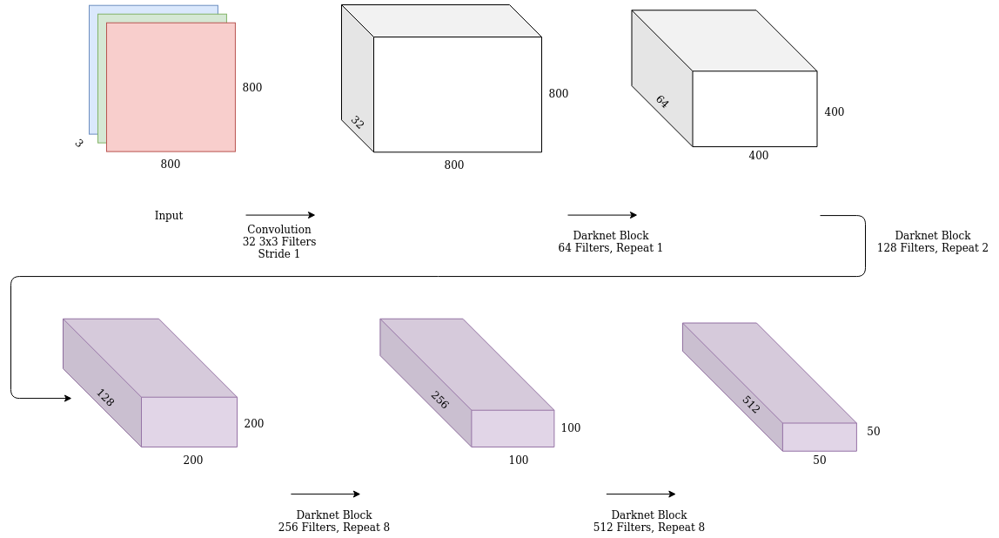
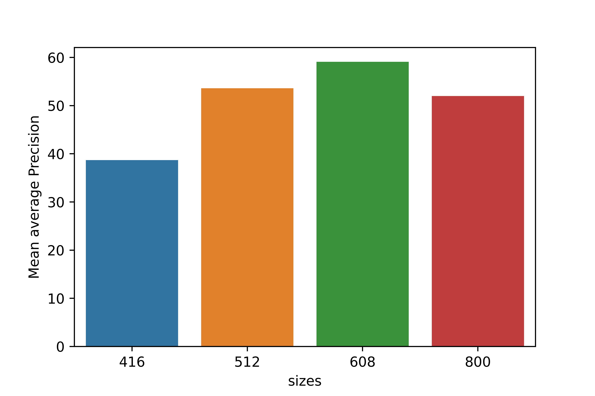

# Deep Learning for Automatic Seal Counting

Europe is home to 83,000 harbour seals, 35% of which reside in British waters. The UK also harbors 40% of the rare grey seal species, most of which could be found in Scottish waters. Due to their dwindling population numbers, however, the species have been declared protected under the Scottish Marine Act of 2010 and are the focus of a number of [conservation efforts](https://www.nature.scot/plants-animals-and-fungi/mammals/marine-mammals/seals). Because of their dwindling numbers, it becomes increasingly crucial to be able to accurately monitor seal population trends. Aerial surveys are traditionally carried out to retrieve general estimates about the abundance of sea mammals in designated conservation zones and is often carried out by scientists. Seal counting is a very tedious and time consuming task, as the seals often only occupy a small section of an aerial image making them tiny and difficult to spot. 

This dissertation adapts You Only Look Once, a single shot object detector which uses deep learning to localise objects of interest such as seals. The algorithm is designed to process \(416 x 416 \) pixel images but the images in question vary from (3300 x 3300) to (60,000 x 60,000) pixels. This dissertation re-implements and adapts YOLO's architecture to handle these large images whilst optimising its performance on the seal counting task. A data generation pipeline was constructed to scale up the model to accept 416, 512, 608 and 800 pixel wide patches from the aerial images. This was essential to estimate how the model grows with input size and calculate the required memor requirements to fit the large input size by measuring the memory taken by the model at each scale up step. An optimised feature extractor was also developed which improved seal localisation. 

The new feature extractor managed to beat Darknet 53 by 15\% when training on 416 pixel patches whilst using half of the parameters used by the original YOLO V3 implementation.

The dissertation was submitted in partial fulfilment for an MSc in Artificial Intelligence from the university of St. Andrews.


## Requirements

- :snake: Python 3.8
- Anaconda
- Open Cv
- Tensorflow 2.2
- Pandas
- Numpy 

## Structure

The project consists of a number of moving parts which was required to accomodate the different experiments that were run.

### Data extraction

The aerial images were too large to train on with the provided hardware. As such, a data generation pipeline was devised to generate patches from the aerial images of the required input size. 

The pipeline consists of transforming extracted patches into tfrecords. This is done through the data/generate_tf_records.py script.
The following script generates tf records consisting of 416 pixel wide patches. The generated patches are sharded amongst a number of tf record files and hence an output directory must be specified. This was done to take advantage of the multiprocessing built into tensorflow when loading, shuffling and batching a tfrecord dataset.

```bash
python data/generate_tf_records.py --output_location /data2/seals/tfrecords/416 --image_size 416
```

### Model Definition

The yolo model consists of a backbone, neck and head. The backbone extracts features used for detection, whilst the head performs the detection. These are connected by the neck which is a set of output layers from the backbone, used for input in the head module.

These are implemented in the yolo package where yolo.layers implements the blocks used in the network and yolo.models implements the yolo models in tensorflow 2.

The following figure shows the darknet dense backbone designed for input patches of 800 x 800 pixel images 



The following figure shows a Yolo V3 head module using 3 output scales for predicting the seal locations adapted for input images of 416 x 416 pixels. 


### Training

The training script is implemented in the root directory. Eager mode training and graph training was also implemented and can be triggered using the flags. The script has th following flags:

  - backbone: <original|dense>: original: the original YOLOv3 with darknet 53,
    dense: Customised yolo v3 with a downsampling factor of 16,
    (default: 'original')
  - head: <yolo3|yolo3_dense_2|yolo3_dense_1>: original: the original YOLOv3
    with darknet 53,yolo3_dense_2: Customised yolo v3 with a downsampling factor
    of 16, and two scales
    (default: 'yolo3')
  - batch_size: batch size
    (default: '8')
    (an integer)
  - classes: path to classes file
    (default: 'data/data_files/seal.names')
  - dataset: path to dataset
    (default: '/data2/seals/tfrecords/1024/train')
  - disable_prefetch: A flag that disables prefetch for memory estimation
    (default: 'false')
  - epochs: number of epochs
    (default: '20')
    (an integer)
  - learning_rate: learning rate
    (default: '0.001')
    (a number)
  - mem_eval: A flag that disables gpu usage and activates cpu usage for
    memory evaluation
    (default: 'false')
  - mode: <fit|eager_fit|eager_tf>: fit: model.fit, eager_fit:
    model.fit(run_eagerly=True), eager_tf: custom GradientTape
    (default: 'fit')
  - out_dir: the model output
    (default: '/home/md273/model_zoo/416/')
  - record_csv: the all records csv frame to calculate the anchor boxes
    (default: '')
  - sample_train: The number of datapoints to take for smaller experiment runs
    (default: '-1')
    (integer >= -1)
  - size: the model image size
    (default: '416')
    (an integer)
  - validation: the size of the validation set
    (default: '0.2')
    (a number)
    
The following command starts training a 416 input image model with the darknet dense backbone, using two scales for prediction using the eager implementation.

```bash
python train.py --size 416 --batch_size 8 --dataset /data2/seals/tfrecords/416/train --out_dir /home/md273/model_zoo/416_model/ --record_csv /data2/seals/tfrecords/416/train/records.csv --backbone original --head yolo3_dense_2 --mem_eval --mode eager_tf --sample_train 10,000 --epochs 50
```

## Results

 The following average precision was obtained for the various input sizes used for evaluation
 
 As the dataset is heavily skewed towards whitecoat seals, the models were samples were all labeled as seal. Multiclass seal classification was out of scope and would require further data augmentation to classify under-represented seals breeds properly.
 
 This was not an issue as the main important factor from the project was to localise seals.
 
 

 

